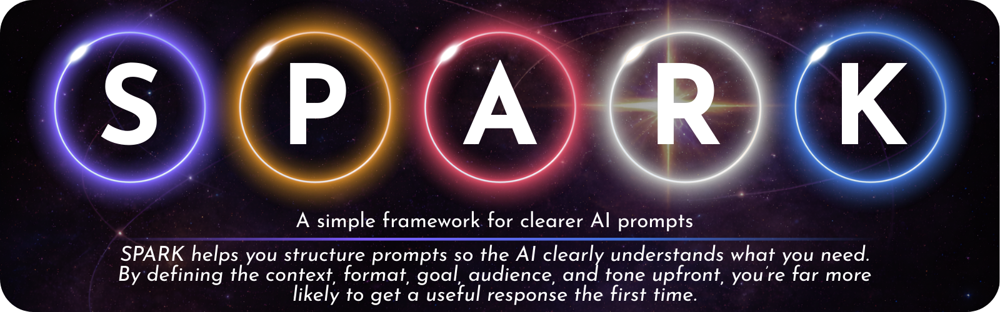
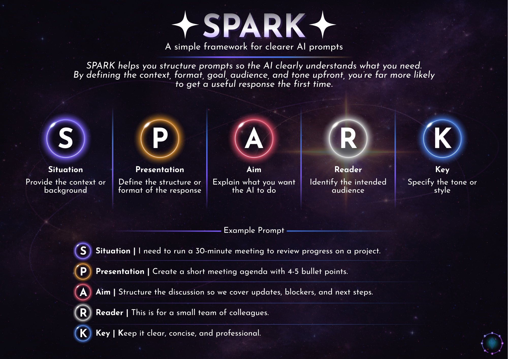

<p align="center">
  
</p>

---

SPARK is a lightweight prompting framework designed to help people write clearer instructions when working with AI tools.

Many frustrating AI interactions come from vague prompts. When an AI lacks context, structure, source material, audience information or clear boundaries, it has to guess. This often leads to responses that require multiple rounds of correction.

SPARK encourages users to include five small but important pieces of information in their prompt. This results in a stronger first response, less guesswork and far less back-and-forth.

> **May 2026 update**
>
> The original framework focused on five practical parts of a strong prompt. That structure still works. The updated version keeps the same mnemonic, while expanding each element to reflect how AI use has moved on. Modern AI work is no longer only about getting a better answer from a chatbot. It often involves source material, file uploads, reasoning models, structured outputs, accessibility, privacy and checking whether the answer can be trusted. SPARK therefore remains simple enough for everyday users, while adding optional checks for higher-risk or more professional use.

---

## Contents

- [SPARK in One Line](#spark-in-one-line)
- [The Updated SPARK Framework](#the-updated-spark-framework)
- [What Changed From the Original Version](#what-changed-from-the-original-version)
- [Why SPARK Works](#why-spark-works)
- [Classic SPARK Prompt Template](#classic-spark-prompt-template)
- [SPARK+ Prompt Template](#spark-prompt-template)
- [Example: Without SPARK](#example-without-spark)
- [Example: Using Updated SPARK](#example-using-updated-spark)
- [Example: SPARK+ for Evidence-Based Work](#example-spark-for-evidence-based-work)
- [When to Use SPARK](#when-to-use-spark)
- [Practical Reliability Rules](#practical-reliability-rules)
- [Accessibility and Inclusion Add-On](#accessibility-and-inclusion-add-on)
- [Structured Output Add-On](#structured-output-add-on)
- [Design Philosophy](#design-philosophy)
- [Research Alignment](#research-alignment)
- [Suggested Reading](#suggested-reading)
- [Using SPARK](#using-spark)
- [Portfolio Summary](#portfolio-summary)

---

## SPARK in One Line

<p align="center">
<b>Situation → Presentation → Aim → Reader → Key</b>
</p>

Give the AI the context, output shape, task, audience and tone, then state what evidence or limits matter.

---

## The Updated SPARK Framework

|  | Element | Updated meaning | Ask yourself |
|------|------|------|------|
|  | Situation | Context, background, source scope and constraints | What is this about? What source material or rules should the AI use? Is anything time-sensitive? |
|  | Presentation | Output format, structure, length and schema where needed | Should the response be an email, table, checklist, JSON, lesson plan, poster text or something else? |
|  | Aim | The task, intended outcome and success condition | What should the AI actually do, and what would make the answer useful? |
|  | Reader | Audience, reading level, language, accessibility and localisation | Who is this for, and what level or support needs should the response account for? |
|  | Key | Tone, style, evidence posture, uncertainty rule and boundaries | What should it sound like? Should it cite sources, avoid assumptions, ask questions or flag uncertainty? |

Each element reduces ambiguity and helps the AI generate a response that is closer to what you actually need.

---

## What Changed From the Original Version

| Original SPARK element | Keep | Update |
|---|---|---|
| Situation | Context still matters | Add source scope, recency, assumptions and what information the AI should rely on |
| Presentation | Format still matters | Add structured outputs for software use, such as JSON, CSV or fixed tables |
| Aim | The goal still matters | Add a success condition, so the AI knows when the task is complete |
| Reader | Audience still matters | Add reading level, accessibility needs, language and localisation |
| Key | Tone still matters | Separate style from reliability, including citations, uncertainty and refusal or clarification rules |

---

## Why SPARK Works

Large language models generate responses by predicting patterns in text. When a prompt is vague, the model has to infer missing details, such as audience, format, tone, level of detail, source basis and intended use.

For example, if someone asks:

> *Write something about climate change.*

The AI has to guess:

- the audience
- the format
- the level of detail
- the tone
- the purpose
- the evidence standard
- whether the answer needs to use specific sources

These guesses often lead to responses that are technically correct but not useful.

SPARK reduces this uncertainty by providing structure. Instead of guessing, the AI receives clear guidance which significantly improves the quality of the first response.

---

## Classic SPARK Prompt Template

Use this when the task is low-risk, everyday or creative.

```text
Situation:
[Give the background or context.]

Presentation:
[Say what format you want.]

Aim:
[Explain what you want the AI to do.]

Reader:
[Say who the response is for.]

Key:
[Set the tone, style or important requirements.]
```

---

## SPARK+ Prompt Template

Use this when accuracy, source use, accessibility or consistency matters.

```text
Situation:
[Give the context, relevant background and any source material the AI should use.]
[State whether the information is time-sensitive or must be based only on supplied sources.]

Presentation:
[Define the response format, structure, length and any headings.]
[If the output will be used by software, define the exact table, CSV or JSON schema.]

Aim:
[State the task clearly.]
[Add a success condition, such as: “A good answer will...”]

Reader:
[Define the audience, reading level, language, accessibility needs and local context.]

Key:
[Define tone and style.]
[Add reliability rules, such as: cite sources, do not invent missing information, flag uncertainty, ask one clarification question if needed.]
```

---

## Example: Without SPARK

Prompt:

> *Write an email reminding people about a deadline.*

Possible issues:

- the message may be too long
- the tone may be too formal or too casual
- key information may be missing
- the structure may not suit the situation
- the AI may include unnecessary filler

The user often has to refine the prompt several times.

---

## Example: Using Updated SPARK

**Situation**

> I need to remind a small project team that their draft sections are due this Friday by 4pm. They need to upload their work to the shared Teams folder called Project Drafts.

**Presentation**

> Write a short email with a subject line, greeting and two short paragraphs.

**Aim**

> Encourage the team to submit on time and make the upload location clear. A good answer will be ready to send without major editing.

**Reader**

> This is for colleagues who are already familiar with the project.

**Key**

> Keep it friendly, clear and professional. Do not sound annoyed. Do not add extra deadlines or invented details.

Because the AI now understands the situation, format, goal, audience, tone and boundaries, the first response is far more likely to be usable.

---

## Example: SPARK+ for Evidence-Based Work

```text
Situation:
I am writing a short briefing for college staff about responsible AI use. Use only the policy notes I provide below and clearly flag anything that is not covered by the notes.

Presentation:
Create a one-page briefing with: Overview, Key points, Risks, Practical actions and Questions to ask before using AI.

Aim:
Turn the notes into a staff-friendly briefing. A good answer will be accurate, usable in training and clear about limits.

Reader:
College teaching and support staff with mixed confidence using AI. Use plain English and avoid technical jargon.

Key:
Use a calm, practical and balanced tone. Do not invent policies, dates or legal requirements. Include a short “Check locally” note where institutional policy is needed.
```

---

## When to Use SPARK

SPARK works well with almost any AI request from academic, professional or personal contexts. The structure reduces guesswork by the AI so you can save time.

It is especially helpful when you want more **consistent outputs from AI systems**.

SPARK is useful for everyday AI tasks, including:

- writing emails, messages and announcements
- summarising notes
- planning lessons, meetings or resources
- drafting student-friendly explanations
- creating first drafts of guidance
- structuring ideas
- adapting tone or reading level
- turning rough thoughts into clearer text

SPARK+ is better when the task involves:

- factual claims
- policy or compliance
- education or assessment
- professional communication
- source material
- private or sensitive data
- outputs that will be reused
- outputs that feed into software

---

## Practical Reliability Rules

SPARK improves the quality of the prompt, but it does not guarantee that the output is correct.

For higher-value tasks, add one or more of these rules to the **Key** section:

```text
Use only the information I provide.
Flag anything that is missing or uncertain.
Do not invent facts, dates, references or policy requirements.
Ask one clarification question if the task cannot be completed safely.
Use plain English and avoid unnecessary jargon.
Cite the source section or document where possible.
Separate fact from recommendation.
```

---

## Accessibility and Inclusion Add-On

When writing for learners, staff or public audiences, expand **Reader** like this:

```text
Reader:
This is for [audience]. Use [reading level]. Use UK English. Keep paragraphs short. Use clear headings. Avoid idioms unless explained. Include alt text suggestions for images if relevant.
```

This keeps SPARK aligned with inclusive design rather than treating accessibility as an afterthought.

---

## Structured Output Add-On

When the AI output will be copied into a spreadsheet, app, database or workflow, expand **Presentation** like this:

```text
Presentation:
Return only a table with these columns: Task | Owner | Deadline | Priority | Notes.
Do not add extra columns.
If a value is missing, write “Not provided”.
```

For software use, this can become a stricter schema:

```json
{
  "tasks": [
    {
      "task": "string",
      "owner": "string or Not provided",
      "deadline": "string or Not provided",
      "priority": "Low | Medium | High | Not provided",
      "notes": "string"
    }
  ]
}
```

---

## Design Philosophy

SPARK is intentionally simple.

It is not designed to be a rigid rule system, a technical specification, a safety system or a replacement for human judgement. Instead, it acts as a small mental checklist that helps people communicate more clearly with AI systems.

Good prompting is not about clever tricks or magic phrases. It is about clarity: giving the system enough context, direction and boundaries to produce something genuinely useful.

---

## Research Alignment

This updated version is aligned with current guidance from:

- OpenAI guidance on relevant context, clear instruction sections, examples and context windows in prompt design
- OpenAI guidance on structured outputs and evaluation as reliability techniques for production systems
- OpenAI reasoning guidance, which encourages simple and direct prompts for reasoning models
- Microsoft Learn guidance on clear goals, workflow structure, tone, output format, examples, capabilities and iterative testing
- Jisc guidance for safe, ethical and responsible AI use in FE, including transparency, fairness, accountability, data protection, accessibility and contestability
- W3C WCAG 2.2 guidance for accessible digital content and interfaces

---

## Suggested Reading

- OpenAI API Docs, Prompt Engineering: https://developers.openai.com/api/docs/guides/prompt-engineering
- OpenAI API Docs, Structured Outputs: https://developers.openai.com/api/docs/guides/structured-outputs
- OpenAI API Docs, Evaluation Best Practices: https://developers.openai.com/api/docs/guides/evaluation-best-practices
- OpenAI API Docs, Reasoning Best Practices: https://developers.openai.com/api/docs/guides/reasoning-best-practices
- Microsoft Learn, Prompt Engineering Techniques: https://learn.microsoft.com/en-us/azure/foundry/openai/concepts/prompt-engineering
- Microsoft Learn, Declarative Agent Instructions: https://learn.microsoft.com/en-us/microsoft-365/copilot/extensibility/declarative-agent-instructions
- Jisc, Principles for the use of AI in FE colleges: https://www.jisc.ac.uk/further-education-and-skills/principles-for-the-use-of-ai-in-fe-colleges
- Jisc, Ethical and responsible AI in education: https://www.jisc.ac.uk/training/ethical-and-responsible-ai-in-education

---

## Using SPARK

SPARK was created as a practical prompting structure for working with AI systems in everyday tasks.

You are welcome to use, adapt and share the framework in documentation, training or personal workflows.

Attribution is appreciated but not required.

---

## Portfolio Summary

SPARK is a human-friendly AI prompting framework that turns vague requests into clearer instruction briefs. The updated version keeps the original simplicity, while adding modern safeguards around evidence, source scope, accessibility, structured outputs, uncertainty and validation.

---

<p align="center">

</p>

<p align="center">
<i>A visual overview of the SPARK prompting framework.</i>
</p>
